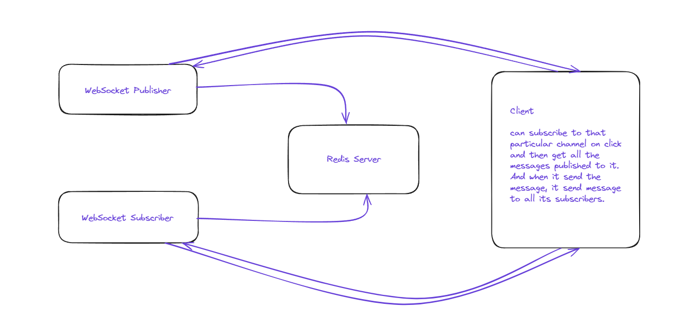

**Architecture**

- **WebSocket Servers**

  - **Publisher Server**: For publishing the data to subscribers
  - **Subscriber Server**: For subscribing to a particular channel/chat_room

- **Redis Pub/Sub**

  - **Redis** will provide pub sub model.

**Scaling Strategy**

- `Horizontal Scaling of WebSocket Servers`

- `Redis as a Messaging Broker`: It ensures that messages published are broadcasted to all subscribed to the same channel. This is achieved through channel subscription and message publishing.

